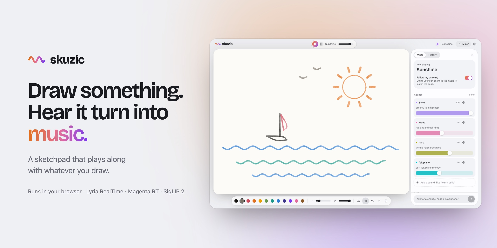

<picture>
  <source media="(prefers-color-scheme: dark)" srcset="docs/cover-dark.jpg">
  
</picture>

# skuzic

**Draw something. Hear it turn into music.**

[](https://github.com/thisisvaze/skuzic/actions/workflows/ci.yml)
[](LICENSE.md)

**[Play it now at skuzic.vercel.app](https://skuzic.vercel.app).** No sign-up:
it plays on a shared key. If the music is slow to start or has gaps, connect
your own free Gemini key in Settings.

skuzic is an instrument you play with a pen. Sketch a house and the music gets
warm and woody. Scribble a storm and it darkens. The song never stops or
restarts. It just keeps bending around whatever you draw.

```
you draw a house
  → you hear the paper under the pen
  → you lift the pen: SigLIP 2 reads what you drew, also in the browser: "house"
  → the band follows: cozy and nostalgic, warm Rhodes in front, the beat never stops
  → Lyria RealTime plays the new sound, live
```

On a blank page you can start from a vibe: lo-fi, ambient, solo piano, indie
folk, bossa nova, a jazz café or a string quartet. Tap one to hear a short
preview; your first stroke starts the band in it, and your drawing then moves
the mood inside it. Or just draw, and let the page pick. Wipe the page and the
band winds down to silence.

Want to steer it yourself? Open the **Mixer**. Every sound is a fader you can
turn up, switch off or rewrite in plain words, and knobs like Energy and
Brightness do what they say. At the bottom, tap **Reimagine** and Gemini rewrites
the whole arrangement from your drawing, or type what you'd like changed instead.

Works in the browser and on iPad/iPhone, pen sound and all. On a Mac you can
also make the music offline with Google's open Magenta RT2 model, but only
when you run skuzic yourself with the Magenta bridge set up. The hosted site
always plays Lyria.

## Run it yourself

### With a coding agent

Paste this into Claude Code, Codex or any coding agent:

```text
Clone https://github.com/thisisvaze/skuzic and run it locally for me. Install
with pnpm (enable it with corepack if it's missing), start `pnpm dev`, and
open http://localhost:5173. I'll connect my own Gemini key in the app when it
asks.
```

To also play offline with Magenta RT2 (Apple Silicon Mac, about a 6.5 GB
one-time download), paste this after it:

```text
Now set up the Magenta RT2 bridge by following server/README.md, start it,
and tell me when to pick Magenta RT under Settings → Music engine.
```

### By hand

```bash
git clone https://github.com/thisisvaze/skuzic && cd skuzic
pnpm install
pnpm dev
```

Open http://localhost:5173, hit **Start drawing**, and connect a free Gemini
key from [aistudio.google.com/apikey](https://aistudio.google.com/apikey) when
it asks. skuzic checks the key with Google before saving it, and it stays in
your browser. Or put `GEMINI_API_KEY=...` in `.env` and the dev server plays
on it like the hosted demo, with no pasting. The first visit also downloads
SigLIP 2's image model (63 MB, cached after that).

**Magenta RT2, offline.** Apple Silicon only. Follow
[server/README.md](server/README.md), run the bridge, then pick **Magenta RT**
under Settings → Music engine. Magenta makes the music on your Mac; Reimagine
still asks Gemini. It isn't available on skuzic.vercel.app, which has no
bridge to talk to.

On iPad/iPhone: open `ios/Skuzic.xcodeproj`, run, then **Settings** (gear) and
paste the same kind of key. It lives in the Keychain, not the app binary. The
on-device drawing reader (59 MB) isn't in the repo: build it once with
`scripts/make-siglip-coreml.py` (the command is at the top of the file). Until
then, lifting the pen asks Gemini.

## Build it with us

skuzic is early and there's a lot of fun stuff left to make:

- 🎛️ **Give it taste.** `src/vision/palette.json` holds the vibes, moods and
  instruments a drawing can turn into. Add a vibe, a mood like "snow", or an
  instrument you love; you don't need to know anything about audio.
- ✏️ **Read drawings better.** Right now the whole page is one picture. Where
  you draw, how fast, and how hard you press could all shape the music.
- 🎹 **Draw melodies.** Magenta RT takes piano-roll notes. Today skuzic uses
  them to hold a chord loop; lines could become tunes.
- 🎚️ **Play it like a deck.** Map a MIDI controller to the mixer, pick a genre,
  or record a clip to share.
- 🎮 **Play it with anything.** Game events, sensors, scrolling. If it can say
  "something happened", it can make music.

The [open issues](https://github.com/thisisvaze/skuzic/issues) each say where to
start, and the [good first ones](https://github.com/thisisvaze/skuzic/labels/good%20first%20issue)
are small. [CONTRIBUTING.md](CONTRIBUTING.md) gets you set up, and
[docs/how-it-works.md](docs/how-it-works.md) has the long version of how it all
fits together.

## Hosting your own

The build is a static site plus one function, `api/gemini.mjs`. On Vercel,
import the repo with the Vite preset and it works as is: every visitor
connects their own key.

To let people play without one, add `GEMINI_API_KEY` under Settings →
Environment Variables and redeploy. The function then relays Lyria and
Reimagine with that key, which never reaches the browser. Cap what it can
cost: add a rate limit on `/api/gemini` in Vercel's Firewall and a budget on
the key's Google Cloud project. Each listener streams about 18 MB a minute
through the function, and Vercel Hobby ends each connection after 5 minutes
(skuzic reconnects, with a short dip).

To keep bots off the shared key, add Cloudflare Turnstile: make a widget for
your domain in Cloudflare's dashboard (Invisible or Managed), set its keys as
`TURNSTILE_SITE_KEY` and `TURNSTILE_SECRET_KEY`, and redeploy. The page clears
the check in the background and gets an hour's pass, and the function turns
away anything without one. Visitors who connect their own key never meet it.

## Good to know

- A key you connect stays in your browser (web) or the Keychain (iOS) and goes
  only to Google. It is not in the repo or the shipped binary. The shared demo
  key lives only on the server.
- Lyria RealTime is an experimental Google model, so limits can change.

## License

[MIT](LICENSE.md) © 2026 Aaditya Vaze. Use it, change it, build on it. A link
back is always appreciated.
